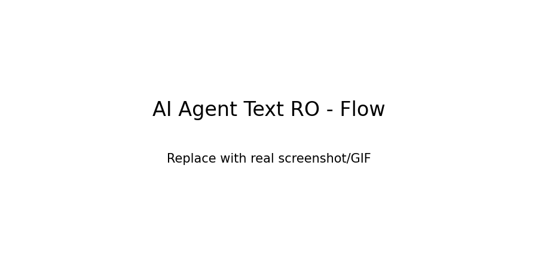

# AI Agent Text RO

Deterministic Romanian/English text agent with a config-driven pipeline, persistence, and tests.
This is intentionally not an LLM; behavior is explainable and reproducible by design.

[](https://github.com/teogame3d-alt/ai-agent-text-ro/actions/workflows/ci.yml)



## Problem
Teams often need predictable text automation for QA and product workflows without black-box behavior.

## Solution
A deterministic intent-matching pipeline (bag-of-words + cosine similarity) with policy rules,
FAQ fallback, a learning queue, and SQLite memory for conversation history.

## Tech
Python, NumPy, SQLite, PyQt6, langdetect, pytest, GitHub Actions.

## Impact
- Explainable responses suitable for QA and review
- Config-driven behavior for fast iteration
- Tests + CI for regression safety

## Engineering Focus
- Deterministic NLP pipeline over opaque model behavior
- Traceable decisions through thresholds and policy gates
- Production-style structure (`src/`, `tests/`, `docs/`, CI)

## Features
- Romanian intent matching (bag-of-words + cosine similarity)
- Config and data-driven responses
- SQLite memory (conversation history)
- FAQ fallback for unknown intents
- Learning queue (human-in-the-loop)
- Policy allow/deny rules (safe responses)
- Optional TTS (gTTS online + pyttsx3 offline fallback)

## Quick Start
```bash
python -m venv .venv
.venv\Scripts\python -m pip install -U pip
.venv\Scripts\python -m pip install -e .[dev]
.venv\Scripts\python -m ro_ai_agent
```

## UI (PyQt6)
```bash
.venv\Scripts\python -m ro_ai_agent.ui_app
```

## Optional Voice
```bash
.venv\Scripts\python -m pip install -e .[voice]
```
Then in config, set `enable_voice = true`.
If `gTTS` is used, `playsound` (1.2.2) will play audio without opening the mp3 file.

## Demo (Employer)
1. Run the CLI and ask a known intent question in Romanian.
2. Ask an unknown question and see the learning queue update.
3. Open the UI and review the Teach tab to approve a learned response.

## Config
`data/config.json` controls thresholds and voice behavior.

## FAQ
`data/faq_ro.json` adds keyword-based fallback answers when no intent matches.

## Learning & Policy
- Unknown questions are saved to a learning queue in SQLite.
- You can approve answers in the UI (Teach tab) and the agent learns them.
- You can add deny keywords to block specific topics.

## Tests
```bash
.venv\Scripts\python -m pytest
```

## Design Decisions
See `docs/DECISIONS.md`.

## Data
- `data/memory.db` is created at runtime and is not tracked.
- Sample config/intents/FAQ live in `data/` and are safe to publish.
- `data/learned_faq.json` is generated at runtime as a visible learning log.
