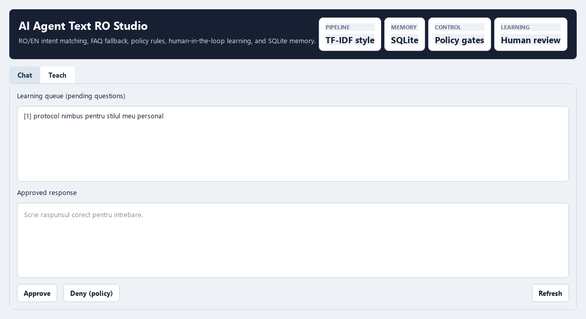

# AI Agent Text RO

Romanian/English AI Agent concept that can learn from user-approved answers, remember conversation history, and adapt behavior through explicit policy rules.
The current implementation uses a deterministic, config-driven text pipeline so every decision remains explainable, testable, and owned by this project.

[](https://github.com/teogame3d-alt/ai-agent-text-ro/actions/workflows/ci.yml)



The PyQt6 UI has been refreshed as a small studio view: quick prompts, confidence display,
pipeline summary cards, and a Teach tab for human-in-the-loop learning.

## Problem
Personal assistants and support bots should be useful without becoming impossible to inspect or control.
The goal is an agent that can be taught by the user, remember approved knowledge, and follow explicit behavior rules.

## Solution
An AI Agent-style workflow built from transparent components:
intent matching, FAQ fallback, a learning queue, human-approved answers, policy allow/deny rules,
and SQLite memory for conversation history.

## Tech
Python, NumPy, SQLite, PyQt6, langdetect, pytest, GitHub Actions.

## Impact
- Explainable responses suitable for QA and review
- Config-driven behavior for fast iteration
- Tests + CI for regression safety
- UI screenshot shows deterministic reasoning, memory, policy, and learning signals clearly
- Demonstrates a user-trainable agent workflow without relying on hidden external services

## Engineering Focus
- Deterministic NLP pipeline over opaque model behavior
- Traceable decisions through thresholds and policy gates
- Production-style structure (`src/`, `tests/`, `docs/`, CI)

## Features
- Romanian intent matching (bag-of-words + cosine similarity)
- Config and data-driven responses
- SQLite memory (conversation history)
- FAQ fallback for unknown intents
- Learning queue for unknown user questions
- User-approved answers saved as learned knowledge
- Policy allow/deny rules to shape how the agent behaves
- Optional TTS (gTTS online + pyttsx3 offline fallback)
- PyQt6 studio-style UI with quick prompts and confidence feedback

## Quick Start
```bash
python -m venv .venv
.venv\Scripts\python -m pip install -U pip
.venv\Scripts\python -m pip install -e .[dev]
.venv\Scripts\python -m ro_ai_agent
```

## UI (PyQt6)
```bash
.venv\Scripts\python -m ro_ai_agent.ui_app
```

## Optional Voice
```bash
.venv\Scripts\python -m pip install -e .[voice]
```
Then in config, set `enable_voice = true`.
If `gTTS` is used, `playsound` (1.2.2) will play audio without opening the mp3 file.

## Demo Flow
1. Run the CLI and ask a known intent question in Romanian.
2. Ask an unknown question and see the learning queue update.
3. Open the UI and review the Teach tab to approve a learned response.
4. Ask the question again and confirm the agent now uses the approved answer.

## Config
`data/config.json` controls thresholds and voice behavior.

## FAQ
`data/faq_ro.json` adds keyword-based fallback answers when no intent matches.

## Learning & Policy
- Unknown questions are saved to a learning queue in SQLite.
- You can approve answers in the UI (Teach tab), and the agent reuses that learned knowledge later.
- You can add deny keywords to block topics or guide behavior.
- This makes the project a personal AI Agent prototype: the user remains in control of what the agent learns.

## Tests
```bash
.venv\Scripts\python -m pytest
```

## Design Decisions
See `docs/DECISIONS.md`.

## Data
- `data/memory.db` is created at runtime and is not tracked.
- Sample config/intents/FAQ live in `data/` and are safe to publish.
- `data/learned_faq.json` is generated at runtime as a visible learning log.


## Mentor Notes
See docs/MENTOR_NOTES.md for design rationale, tradeoffs, and implementation decisions.

